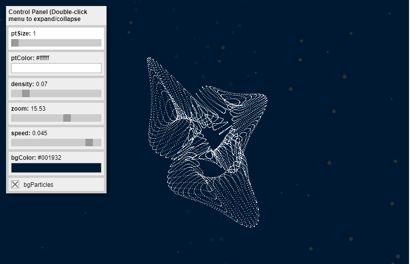

# geo_p5_GraphVis_Basic
p5.js Exploration
 
 
This was the initial exploration of the P5.js library and use of the p5.gui library and particles. The following web link demonstrates its active operation with control panel: https://morphingdesign.github.io/geo_p5_GraphVis_Basic/
 
 
Program Screen Captures:
 
 

 
